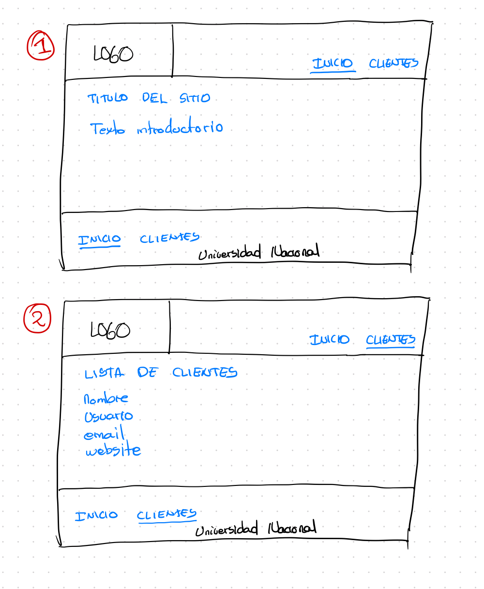
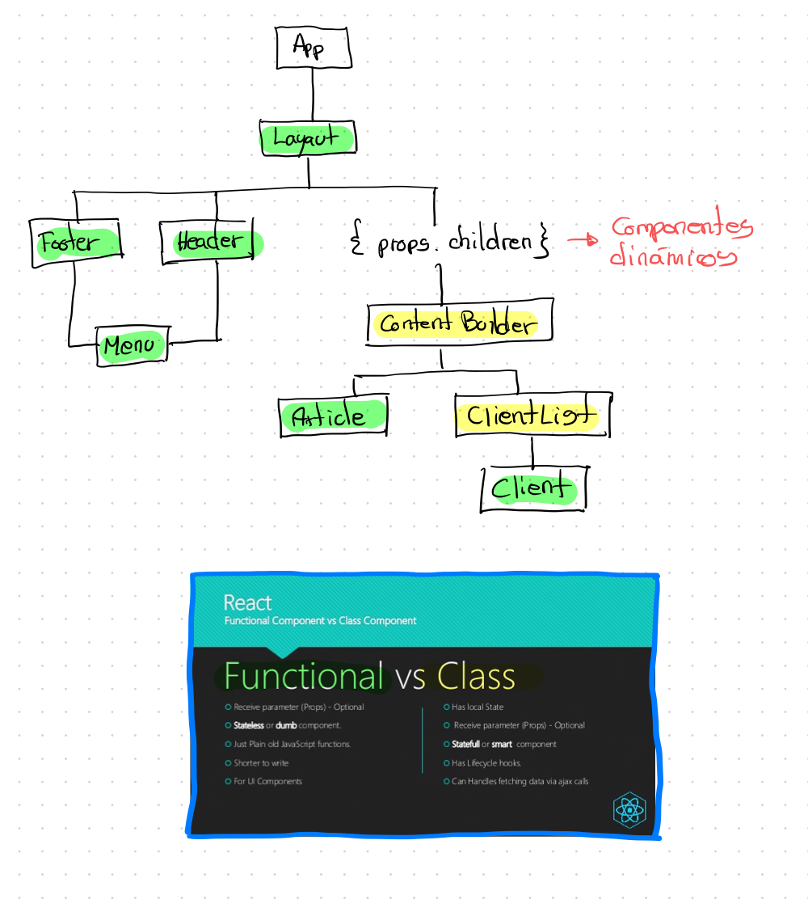
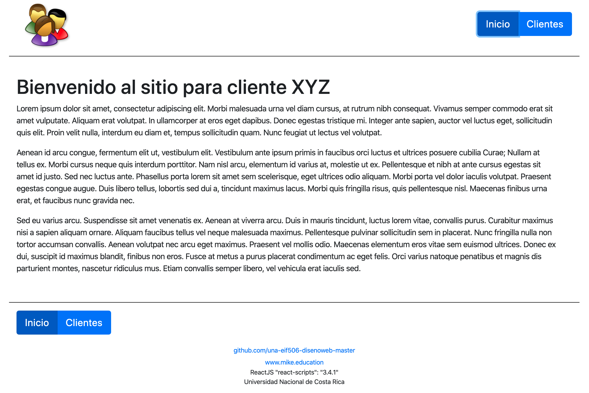
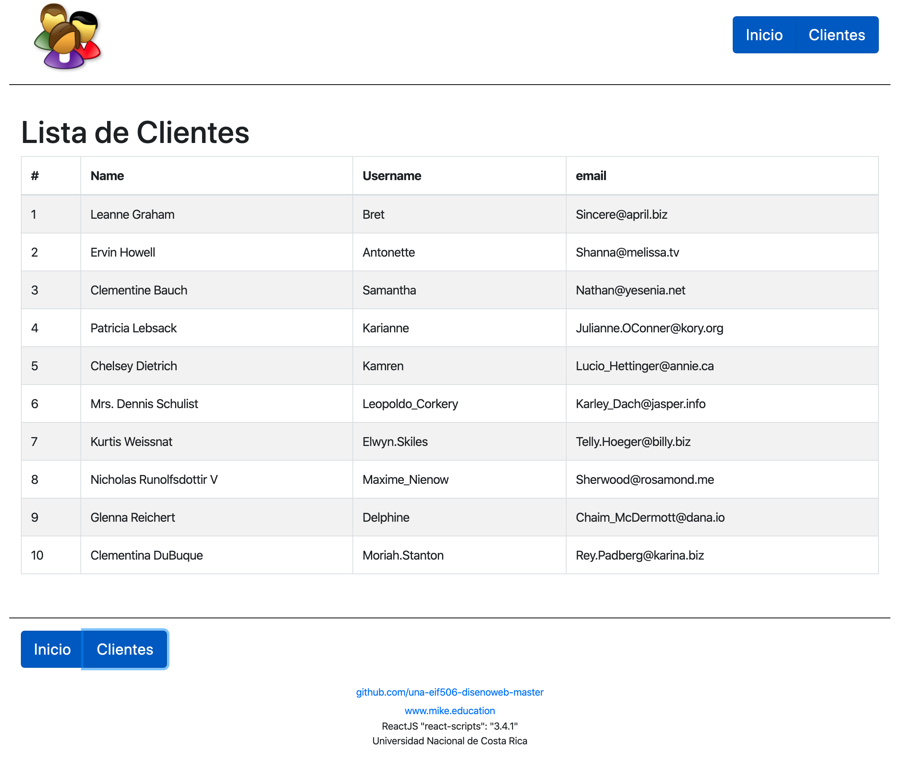

# Aplicación en ReactJS

- La siguiente es una aplicación que se compone de un sitio web que tiene una página de Inicio y una de Clientes.
- En la pagina de clientes hay un request a un Web service
  - https://jsonplaceholder.typicode.com/
  - https://jsonplaceholder.typicode.com/users

## Planificando una aplicación en ReactJS

A continuación se describen los pasos necesarios y previos para desarrollar una aplicación web.

### 1) Definiendo los wireframes

### 2) Estructura de componentes

## Resultado Final

### Inicio

### Lista de Clientes

